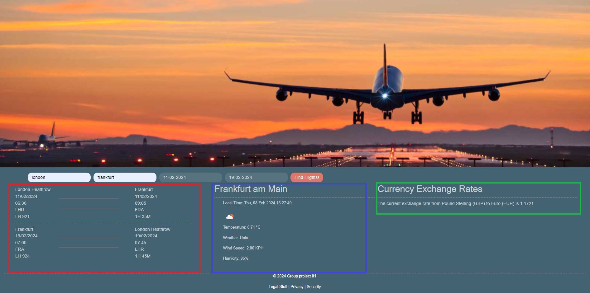
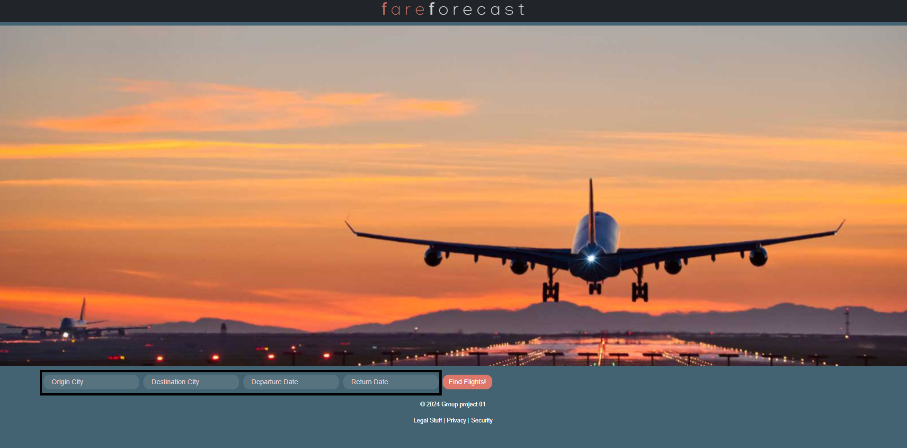

# FareForcast-App

## Description

This the first project we've completed as a group. We the creators (sidm97, bootcampist, terr0y and shazna8181) wanted to build a website that would take a user's input on location of origin and destination and dates of travel to provide information about the places they wanted to travel to and how to get there. We've used a number of APIs. The most important is probably the luftansa flight scheduling API.

Bootcampist worked with this API to fetch pertinent information for flights leaving to the destination (marked in red).
The weather API call was put together by terr0y using the Open Weather API and gives us information about the current weather conditions in the target city (marked in blue).
Sidm97 used the Exchangerate API coupled with Open Weather's geocoding API to use the user input to generate a conversion rate from origin to destination country (marked in green).
All of this information is parsed and assimilated into the HTML that shazna8181 put together, while bootcampist made final adjustments to the styling. We've used a combination of HTML CSS and Javascript to render to the page. We've also used Bootstrap and Jquery in this project for ease of design and coding.

## Features

- City-to-City Insights: Simply input your current location and your travel destination to receive detailed travel information.

- Travel Dates: Select your planned departure and return dates to customize your search to fit your travel schedule.

- Weather Forecast: Stay informed about the weather at your destination to pack appropriately and plan your itinerary.

- Currency Exchange Rates: Understand the currency exchange rates between your home city and destination for better budgeting and financial planning.

## Usage

The user need simply input 4 details (marked) to obtain information. A city they're in currently, a city they'd like to visit, and dates they'd like to depart for and return from the city.

To start using Fare Forecast:

1. Navigate to Fare Forecast Website (https://sidm97.github.io/Fare-Forecast-App/).

2. Follow the on-screen prompts to input your travel details.

3. Input Your Origin City: Enter the city you are traveling from.

4. Input Your Destination City: Enter the city you would like to visit.

5. Select Your Travel Dates: Pick your desired departure and return dates.

6. Get Informed: Click 'Find Flights' to obtain flight details, weather forecasts, and currency exchange information for your destination.

## Installation

No installation required

## Technologies Used

- HTML
- CSS (Bootstrap for styling)
- JavaScript (jQuery for DOM manipulation)
- OpenWeatherMap API
- Flight API
- Currency API
- Bootstrap
- jQuery
- Local Storage

## Deployed URL

Link to repository: https://github.com/sidm97/Fare-Forecast-App

Link to live website: https://sidm97.github.io/Fare-Forecast-App/

## Contributing

We welcome contributions from the community. If you'd like to contribute, please get in touch with us.

## Credits

The Creators

Luftansa's developer network : https://developer.lufthansa.com/

The currency exchange API: https://app.exchangerate-api.com/dashboard

Open Weather : https://openweathermap.org/api

The Skills Bootcamp for teaching us how to use the above to create our finished product.

## License

MIT license

Copyright (c) 2024 Terr0y

Permission is hereby granted, free of charge, to any person obtaining a copy
of this software and associated documentation files (the "Software"), to deal
in the Software without restriction, including without limitation the rights
to use, copy, modify, merge, publish, distribute, sublicense, and/or sell
copies of the Software, and to permit persons to whom the Software is
furnished to do so, subject to the following conditions:

The above copyright notice and this permission notice shall be included in all
copies or substantial portions of the Software.

THE SOFTWARE IS PROVIDED "AS IS", WITHOUT WARRANTY OF ANY KIND, EXPRESS OR
IMPLIED, INCLUDING BUT NOT LIMITED TO THE WARRANTIES OF MERCHANTABILITY,
FITNESS FOR A PARTICULAR PURPOSE AND NONINFRINGEMENT. IN NO EVENT SHALL THE
AUTHORS OR COPYRIGHT HOLDERS BE LIABLE FOR ANY CLAIM, DAMAGES OR OTHER
LIABILITY, WHETHER IN AN ACTION OF CONTRACT, TORT OR OTHERWISE, ARISING FROM,
OUT OF OR IN CONNECTION WITH THE SOFTWARE OR THE USE OR OTHER DEALINGS IN THE
SOFTWARE.
